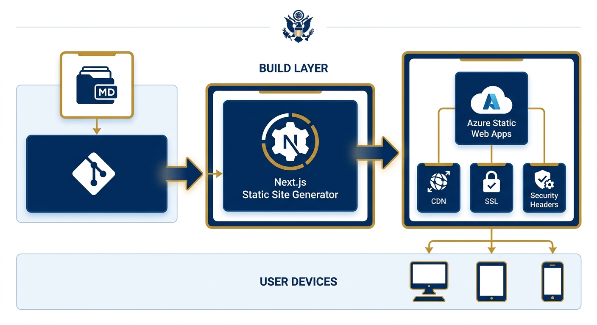
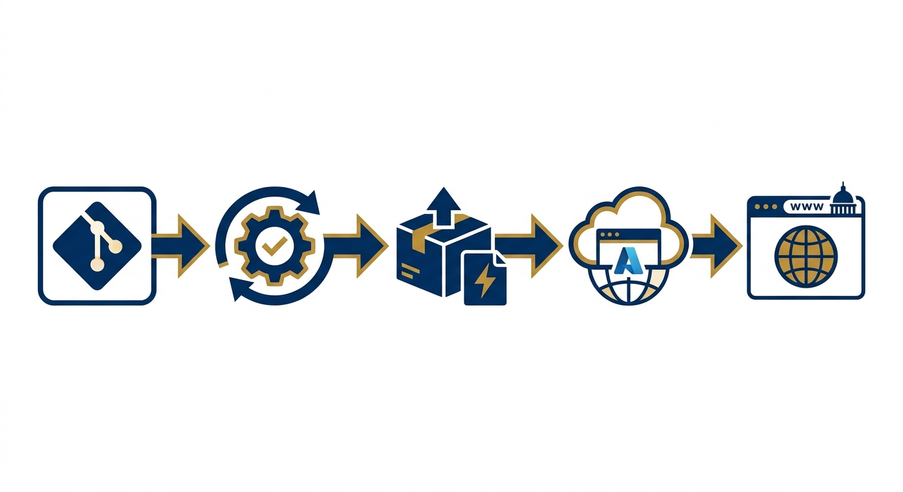
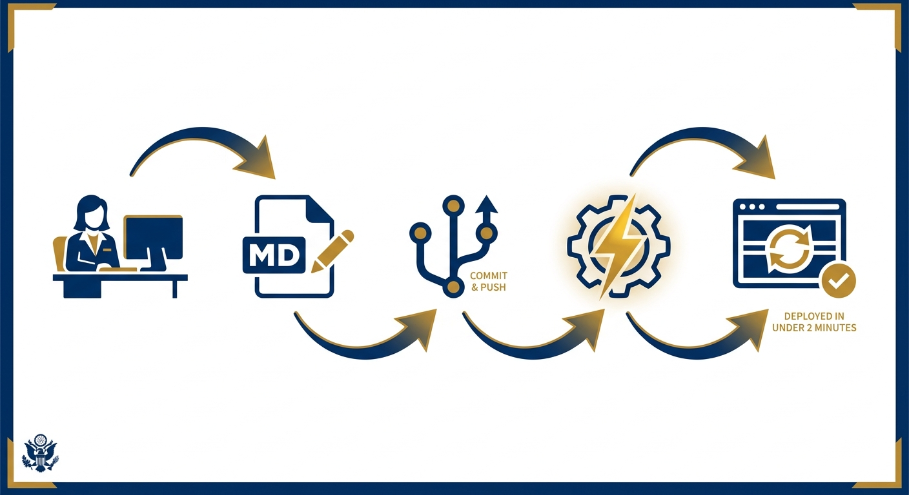

# EOG Static Website — RFQ-26-03 Demo

Working prototype for **EOG-RFQ-26-03: Website Domain Acquisition, Static Website Development, and Complementary Graphic Materials** submitted by Quest Corporation of America.

**Live demo:** [https://eog.qcaclients.com](https://eog.qcaclients.com)

---

## Overview

A 6-page static website built for the Executive Office of the Governor, demonstrating:

- Clean, modern design consistent with State of Florida branding (myflorida.gov / flgov.com conventions)
- WCAG 2.1 AA accessibility compliance
- Responsive layout across desktop, tablet, and mobile
- Static HTML/CSS/JS output — no server-side runtime required
- Git-based content update workflow via markdown files

## Architecture



## Tech Stack

| Layer | Technology |
|-------|-----------|
| Framework | Next.js 15 (static export) |
| Styling | Tailwind CSS 4 |
| Content | Markdown + gray-matter + remark |
| Hosting | Azure Static Web Apps |
| CI/CD | GitHub Actions → Azure deployment |

## Pages

1. **Home** — Hero, key metrics, program highlights, latest news
2. **About** — Initiative background, governance, at-a-glance sidebar
3. **Initiative** — Program details with interactive timeline
4. **Resources** — Reports, documents, external links
5. **News** — Press releases and updates
6. **Contact** — Office information and communication channels

---

## Deployment Procedure



### Prerequisites

- Node.js 20+
- pnpm (recommended) or npm
- Azure account with Static Web Apps resource
- GitHub repository access

### Local Development

```bash
# Install dependencies
pnpm install

# Run dev server
pnpm dev

# Build static export
pnpm build

# Preview production build
npx serve out/
```

### Azure Static Web Apps Deployment

1. **Create Azure Static Web App** resource in Azure Portal
2. **Connect GitHub repository** (`launchthatbrand/eog`) during setup
3. Azure auto-generates a GitHub Actions workflow file
4. Configure build settings:
   - **App location:** `/`
   - **Output location:** `out`
   - **Build command:** `pnpm build`
5. Push to `main` branch triggers automatic deployment

### Manual Deployment (CLI)

```bash
# Install Azure SWA CLI
npm install -g @azure/static-web-apps-cli

# Build the site
pnpm build

# Deploy
swa deploy ./out --deployment-token <YOUR_TOKEN>
```

### Environment Configuration

The `staticwebapp.config.json` file at the project root configures:

- Security headers (CSP, X-Frame-Options, HSTS)
- Trailing slash normalization
- Navigation fallback for client-side routing

### DNS & Domain Transfer

After deployment:

1. Configure custom domain in Azure Static Web Apps → Custom Domains
2. Add CNAME record pointing to the Azure-provided hostname
3. Azure auto-provisions and manages SSL/TLS certificates
4. Transfer registrar admin access to EOG technical contacts

---

## Content Updates



Content lives in `/content/*.md` as markdown files with YAML frontmatter:

```markdown
---
title: "Page Title"
description: "Meta description for SEO"
lastUpdated: "2026-05-19"
---

Page content in standard markdown...
```

**Update workflow:**

1. Edit the relevant `.md` file in `/content/`
2. Commit and push to `main`
3. GitHub Actions automatically rebuilds and deploys (< 2 minutes)

---

## Security

- All pages served over HTTPS with auto-renewed certificates
- Content Security Policy headers configured
- No server-side code — eliminates injection attack surface
- DNSSEC recommended at registrar level

## Accessibility

- Semantic HTML5 structure
- Skip-to-content link
- ARIA landmarks and labels
- Color contrast minimum 4.5:1 (body), 3:1 (large text)
- Keyboard-navigable with visible focus indicators
- Tested with Lighthouse and axe-core

---

## Project Structure

```
eog/
├── content/          # Markdown page content
├── public/           # Static assets (images, favicon)
├── src/
│   ├── app/          # Next.js App Router pages
│   ├── components/   # Reusable UI components
│   ├── lib/          # Content loader, site config
│   └── styles/       # Tailwind globals + design tokens
├── staticwebapp.config.json  # Azure SWA config
├── next.config.js    # Static export configuration
└── package.json
```

---

**Solicitation:** EOG-RFQ-26-03  
**Vendor:** Quest Corporation of America  
**Contract Period:** May 19 – June 30, 2026
